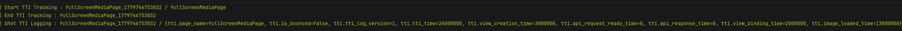
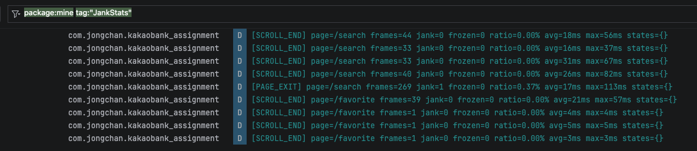

# Dandi

멀티모듈 클린아키텍처 기반의 **Android 템플릿 프로젝트**입니다.
새 프로젝트를 시작할 때 이 프로젝트의 아키텍처(4-레이어 모듈, MVI, Hilt, Navigation3, 디자인 토큰 시스템, TTI/Jank 계측)를 그대로 복제해 사용하고, 저장소에 포함된 Agent Skill 들로 Figma 디자인 스펙 기반의 화면/기능을 빠르게 생성하는 것이 목적입니다.

포함된 4개 feature 는 각각 **서로 다른 아키텍처 패턴의 골든 예제(패턴 카탈로그)** 입니다. 새 기능을 만들 때는 아래 표에서 가장 비슷한 패턴을 베이스로 삼으세요.

| Feature | 골든 예제 패턴 |
|---|---|
| `intro` | 가장 단순한 remote API 4-레이어 (ApiService → DataSource → RepositoryImpl → UseCase) |
| `search` | 페이징, 병렬 API 호출 머지, 리스트 UI, MVI 풀 사이클 |
| `favorite` | 로컬 저장소(SharedPreferences KV + Flow observe), synthetic backstack, bottom tab |
| `fullScreenMedia` | ViewBinding Fragment 혼합 호스팅, 딥링크 typed Args |

> **🎨 Figma/디자인 스펙으로 화면 만들기:** [docs/DESIGN_TO_CODE_GUIDE.md](docs/DESIGN_TO_CODE_GUIDE.md) — Figma MCP 연결, `design-token-sync`, `design-to-feature` 스킬 사용법.

---

## 기술 스택

| 영역 | 사용 기술 |
|---|---|
| 언어 / 빌드 | Kotlin 2.3.21, AGP 9.2.0, JDK 17 |
| UI | Jetpack Compose (BOM 2026.04.01), Material3, Navigation3 |
| DI | Hilt 2.59.2 + KSP |
| 비동기 | Coroutines 1.10.2, Flow |
| 네트워크 | Retrofit 3.0.0, OkHttp 5.3.2, kotlinx.serialization |
| 이미지 / 미디어 | Coil 3.4 (compose / gif / video), Media3 ExoPlayer 1.10 |
| 성능 / 관측 | AndroidX JankStats 1.0.0-beta02, Macrobenchmark, Baseline Profile |
| 테스트 | JUnit4, MockK (도메인 UseCase 단위 테스트); UIAutomator/Macrobenchmark (`:baselineprofile` 전용) |

`compileSdk` / `targetSdk` = 37, `minSdk` = 24 (Baseline Profile 수집은 28+).

---

## 모듈 구조

피처를 **`entity` / `domain` / `data` / `presentation`** 4-레이어로 쪼개고, 그 위에 앱 모듈과 측정 모듈을 둔 구조입니다.

```
app                         실행 가능한 Android Application
├─ common/{entity,domain,data,presentation}      여러 피처에서 공유되는 베이스
├─ main/{entity,domain,data,presentation}        탭/내비게이션 셸
├─ intro/{entity,domain,data,presentation}       스플래시/인트로
├─ search/{entity,domain,data,presentation}        검색
├─ favorite/{entity,domain,data,presentation}    즐겨찾기
├─ fullScreenMedia/{entity,domain,data,presentation}  풀스크린 미디어 뷰어
├─ tti                      TTI(Time To Initial Display) 계측 라이브러리
└─ baselineprofile          Macrobenchmark / Baseline Profile 수집 모듈
```

레이어 간 의존 방향은 `presentation → domain → entity`, `data → domain → entity` 단방향입니다. `entity` 모듈은 순수 Kotlin/JVM 모듈로 다른 의존이 없습니다.

---

## 레퍼런스 feature 구현 내용

### 인트로
- [v] 앱이 ColdStart 하는 과정에서 추천 앱버전, 최소 앱버전에 따른 Alert으로 유저 앱 시작 플로우를 제한하는 컨셉의 아키텍처 설정
- [v] App Link 딥링크 (`https://www.dandi.com/...`)를 활용한 링크 기반 네비게이션 및 합성 백스택 구성 설계

### 검색 (Search)
- [v] 검색 결과 리스트 표시
- [v] 즐겨찾기 아이템 추가/해제
- [v] API 데이터 로드 완료 시점 TTI 마킹
- [v] 앱링크 진입 지원 가능
- [v] 검색 탭 → 풀스크린 진입

### 즐겨찾기 (Favorite)
- [v] 즐겨찾기 Grid 표시
- [v] SharedPreference기반의 FavoriteKVStorage를 활용하여 즐겨찾기 추가된 아이템 리스트 나타내기, 해제 가능, Lottie를 활용한 인터랙션 효과 부여
- [v] 앱링크 진입 지원 가능
- [v] 즐겨찾기 탭 → 풀스크린 진입

### 풀스크린 미디어 뷰어 (FullScreenMedia)
- [v] 스펙에 따라 좌우 슬라이드로 이미지 전환 / Fixed 스펙 만족
- [v] 즐겨찾기 아이템 추가/해제, Lottie를 활용한 인터랙션 효과 부여
- [v] 앱링크 진입 지원 가능
- [v] 유효하지 않은 콘텐츠 Url일떄 Error Alert처리 완료
- [v] 풀스크린 미디어 페이지에서 Back Navigation 지원
- [v] 페이지의 생성, 이미지 로드까지 걸리는 TTI를 측정하는 로직 적용

### 엔지니어링 Feature
- [v] 폰트 및 텍스트 스타일 / 컬러에 대한 Compose Theme 기반의 디자인 시스템 세팅
- [v] App Link / Navigation3 기반 네비게이션 설계
- [v] Domain / Presentation 계층에서 유연하게 활용가능한 Navigation, Message, TTI Helper 구성
- [v] Domain / Presentation 계층에서 상황에 맞게 처리가능한 Error 핸들링
- [v] UseCase에 대한 UnitTest 구성
- [v] Baseline Profile 수집 & 적용 (Cold Start -> 검색("kakao") -> 리스트 스크롤 -> 특정 아이템에 대한 풀스크린페이지 진입)
- [v] JankStats를 활용한 JankFrame 이슈를 모니터링 하기위한 작업 진행
- [v] 페이지별로 어떤 부분에서 로딩타임이 소모되는지 측정 진행이 가능하게하는 TTIHelper 적용
- [v] 엔지니어링 리소스를 효율화 할 수 있는 Skill 구성 및 활용
- [v] SharedPreference 기반의 상태변화를 Flow로 전달받을수 있는 FavoriteKVStorage 구성

---

## 아키텍처 설명

- 각 피처는 4-레이어 모듈로 분해되어 있고 의존성이 안쪽으로 향하는 클린아키텍처를 따릅니다.
- View-ViewData 아키텍처는 MVI로 구성했습니다.

- **`entity`** — 순수 Kotlin/JVM. VO(`MediaItemVO` 등) 와 enum 만 둡니다. 플랫폼 영역 의존이 없습니다.
- **`domain`** — 순수 Kotlin/JVM. `Repository` 인터페이스, `UseCase`, `Page`(라우트 메타) 와 feature별 `HttpErrorType` 구현. 플랫폼 영역 의존이 없습니다.
- **`data`** — `com.android.library`. Retrofit `ApiService`, `DTO(@Serializable, all-nullable)` → `toVO()`, `RepositoryImpl`, Hilt `DataModule(@InstallIn(SingletonComponent::class))`.
- **`presentation`** — `com.android.library`. Compose UI, `@HiltViewModel` ViewModel(StateFlow `UiState` + `sealed interface Intent`), `Page` 구현체의 렌더링.

의존 방향은 단방향입니다: `presentation → domain → entity`, `data → domain → entity`. `data` 와 `presentation` 은 서로를 모릅니다 — 둘 다 `domain` 인터페이스만 봅니다.

**내비게이션은 Navigation3 의 단일 백스택 모델** 위에서, [main/presentation/navigation/AppRouteRegistry.kt](main/presentation/src/main/java/com/swm/dandi/main/presentation/navigation/AppRouteRegistry.kt) 의 `appRoutes: List<AppRoute>` 한 곳에 모든 라우트를 등록합니다.

**DI 는 Hilt `SingletonComponent` 단일 그래프** 입니다. 각 feature 의 `data` 모듈이 자기 `DataModule` 을 들고 다니며 ApiService / DataSource / Repository 바인딩을 격리합니다. `common/data` 의 `NetworkModule` 이 OkHttp / Retrofit / Json 을 한 곳에서 생성합니다.

**DTO ↔ VO 변환 규칙** 이 일관됩니다. DTO 는 `@Serializable` + 전 필드 nullable, VO 는 비-nullable + 기본값. 변환은 `data` 레이어의 `toVO()` 확장 함수에서만 일어나며, 응답 누락 / 스키마 변동에 대한 방어선이 여기에 모입니다.

---

## 성능 측정

### 1. Baseline Profile

`androidx.baselineprofile` 플러그인으로 `:baselineprofile` 모듈에서 프로파일을 수집하고, 빌드 시 `app/src/main/baseline-prof.txt` 로 자동 머지됩니다. 콜드 스타트 시 핫 코드 경로를 미리 AOT 컴파일해 첫 프레임을 더 빨리 띄우는 용도입니다.

### 2. TTI (Time To Interactive)

`:tti` 모듈에서 페이지 단위 TTI를 측정합니다. `Start TTI Tracking` → `End TTI Tracking` → `Shot TTI Logging` 의 3-step 으로 페이지명, API 요청 준비/응답 시각, 바운스 여부 등이 함께 로깅됩니다.
각 페이지에서 핵심적인 이미지/영상이나 웹뷰 등의 시간이 더 오래걸리는 타임라인들을 커스터마이징하여 추가로 측정할수 있습니다.
현재는 "페이지오픈 -> API Request Ready -> API Reseponse Completed" 의 과정에 대해서만 TTI 시간을 측정합니다.


```
Start TTI Tracking : fullscreenMediaPage_1779746753032 / fullScreenMediaPage
End TTI Tracking : fullScreenMediaPage_1779746753032
Shot TTI Logging: fullscreenMediapage779746753032/(tti.page_name=fulScreenMediapage,tti.is_bounced-false, tti.tti_10g_version=1, tti.tti,time=24000000, tti.view creation_time-3000000, tti. api. request ready time=0, tti. api. response time=0, tti. view binding_time=2000000, tti. image loaded time=13000000
```

### 3. JankStats (페이지별 프레임 품질)

AndroidX JankStats를 페이지 라이프사이클에 결합해 페이지를 **빠져나갈 때** 해당 페이지의 프레임 통계(jank/frozen 프레임 수, 비율, 평균/최대 프레임 시간)를 로깅 혹은 전송할수 있습니다.
페이지 이탈, 스크롤이 끝날때, 백그라운드로 나갈때, JankFrame 비율이 5퍼센트를 넘을때, Fronzen 상태일때 - JankStats 로깅을 출력합니다.



Logcat 필터: `package:mine tag:"JankStats"`.

```
[SCROLL_END] page=/search frames=44 jank=0 frozen=0 ratio=0.00% avg=18ms max=56ms states={}
[SCROLL_END] page=/search frames=33 jank=0 frozen=0 ratio=0.00% avg=16ms max=37ms states={}
[SCROLL_END] page=/search frames=33 jank=0 frozen=0 ratio=0.00% avg=31ms max=67ms states={}
[SCROLL_END] page=/search frames=40 jank=0 frozen=0 ratio=0.00% avg=26ms max=82ms states={}
[PAGE_EXIT] page=/search frames=269 jank=1 frozen=0 ratio=0.37% avg=17ms max=113ms states={}
[SCROLL_END] page=/favorite frames=39 jank=0 frozen=0 ratio=0.00% avg=21ms max=57ms states=(}
[SCROLL_END] page=/favorite frames=1 jank=0 frozen=0 ratio=0.00% avg=4ms max=4ms states=(}
[SCROLL_END] page=/favorite frames=1 jank=0 frozen=0 ratio=0.00% avg=5ms max=5ms states={}
[SCROLL_END] page=/favorite frames=1 jank=0 frozen=0 ratio=0.00% avg=3ms max=3ms states=‹}
```

---

## 링크를 통한 앱 동작 테스트

App Link 가 설정되어 있어 `adb shell am start` 로 임의 화면에 직접 진입 / 백스택 합성 / `onNewIntent` 처리까지 한 번에 검증할 수 있습니다.

스킴 / 호스트: **`https://www.dandi.com`** (autoVerify, `MainActivity` `singleTop`)

> 에뮬레이터에서는 App Link autoVerify 미검증으로 위 명령이 브라우저로 빠질 수 있습니다. 이 경우 컴포넌트를 명시: `-n com.swm.dandi/.main.presentation.MainActivity` 를 붙이세요 (verify-screen 스킬과 동일 방식).

| 진입 화면                                                                           | 명령 |
|---------------------------------------------------------------------------------|---|
| 검색                                                                              | `adb shell 'am start -W -a android.intent.action.VIEW -d "https://www.dandi.com/search" com.swm.dandi'` |
| 즐겨찾기 (Search → Favorite 합성 백스택)                                                 | `adb shell 'am start -W -a android.intent.action.VIEW -d "https://www.dandi.com/favorite" com.swm.dandi'` |
| 풀스크린 미디어                                                                        | `adb shell 'am start -W -a android.intent.action.VIEW -d "https://www.dandi.com/fullScreenMedia?origin=DEEP_LINK&type=VIDEO&url=http%3A%2F%2Fwww.youtube.com%2Fwatch%3Fv%3D09S1WWJjpVg&title=%EB%8C%80%ED%95%9C%EB%AF%BC%EA%B5%AD%EC%97%90%20%EB%8B%A8%EC%9D%BC%EC%A2%85%EB%AA%A9%20%EB%A0%88%EB%B2%84%EB%A6%AC%EC%A7%80%20%EC%8B%9C%EB%8C%80%EA%B0%80%20%EB%93%9C%EB%94%94%EC%96%B4%20%EC%98%B5%EB%8B%88%EB%8B%A4%21%20TIGER%20%EC%82%BC%EC%84%B1%EC%A0%84%EC%9E%90%20SK%ED%95%98%EC%9D%B4%EB%8B%89%EC%8A%A4%20%EB%8B%A8%EC%9D%BC%EC%A2%85%EB%AA%A9%20%EB%A0%88%EB%B2%84%EB%A6%AC%EC%A7%80%20%EC%8B%A0%EA%B7%9C%20%EC%83%81%EC%9E%A5%21%20%EC%9C%84%ED%97%98%EC%9D%BC%EA%B9%8C%3F%20%EB%8C%80%EB%B0%95%EC%9D%BC%EA%B9%8C%3F%20%EB%8B%A8%2C%20%EC%9D%B4%EA%B2%83%EB%A7%8C%EC%9D%80%20%EB%B0%98%EB%93%9C%EC%8B%9C%20%EC%95%8C%EC%95%84%EC%95%BC%20%ED%95%A9%EB%8B%88%EB%8B%A4%21&thumbnailImageUrl=https%3A%2F%2Fsearch1.kakaocdn.net%2Fargon%2F138x78_80_pr%2FI5veHfwZIvg&contentsImageUrl=https%3A%2F%2Fsearch1.kakaocdn.net%2Fargon%2F138x78_80_pr%2FI5veHfwZIvg" com.swm.dandi'` |
| 콘텐츠 URL 무효 → Error Alert                                                        | `adb shell 'am start -W -a android.intent.action.VIEW -d "https://www.dandi.com/fullScreenMedia?url=&title=TestAppLInk" com.swm.dandi'` |
| 미등록 path → 인트로 폴백                                                               | `adb shell 'am start -W -a android.intent.action.VIEW -d "https://www.dandi.com/home" com.swm.dandi'` |

---

## 진행 과정에서 활용한 생산성 향상 Agent Skill

Claude Code 사용자는 `.claude/skills/`, Codex 사용자는 `.agents/skills/` 의 같은 이름 스킬을 사용합니다.
각 스킬에는 프로젝트 컨벤션이 세팅되어 있어, AI 코드 생성을 본 코드베이스 스타일에 맞게 진행하고 엔지니어의 생산성을 높일수 있게 하였습니다.
실제 레퍼런스 feature 들의 UI구현 / API 세팅 / 기본 아키텍처 스캐폴딩은 모두 아래의 스킬을 활용했습니다.

| 스킬 이름 | Claude Code | Codex | 역할 |
|---|---|---|---|
| `design-to-feature` | [SKILL.md](.claude/skills/design-to-feature/SKILL.md) | [SKILL.md](.agents/skills/design-to-feature/SKILL.md) | **디자인 스펙(Figma 링크 / 이미지 / PDF) → feature 생성 파이프라인.** 화면 인벤토리 → 골든 예제 선택 → 스캐폴딩 → 토큰 기반 Compose UI → 데이터 레이어 → 라우트 등록 → 빌드 검증을 오케스트레이션 |
| `design-token-sync` | [SKILL.md](.claude/skills/design-token-sync/SKILL.md) | [SKILL.md](.agents/skills/design-token-sync/SKILL.md) | Figma Variables/Text Styles(또는 디자인 이미지) → `DesignTokens.kt` 의 FIGMA-TOKEN-INJECTION-POINT 구간 갱신 + 매핑 리포트 |
| `make-new-feature-module` | [SKILL.md](.claude/skills/make-new-feature-module/SKILL.md) | [SKILL.md](.agents/skills/make-new-feature-module/SKILL.md) | 새 피처 추가 시 `:intro` 모듈을 템플릿으로 4-모듈 세트(entity/domain/data/presentation) 와 `settings.gradle.kts` 등록 라인까지 한 번에 스캐폴딩, 단일 화면(Screen + Stateless Content + ViewModel + UiState + Intent + TestTags + Preview) MVVM 스캐폴딩 |
| `navigation-conventions` | [SKILL.md](.claude/skills/navigation-conventions/SKILL.md) | [SKILL.md](.agents/skills/navigation-conventions/SKILL.md) | 네비게이션/라우트/딥링크 규칙 — NavRoute/Page object, AppRouteRegistry, synthetic backstack, 딥링크 cold/warm 정책, RoutePattern 템플릿, NavigationHelper. 화면·경로·딥링크 추가/수정 시 |
| `api-dto-code-gen` | [SKILL.md](.claude/skills/api-dto-code-gen/SKILL.md) | [SKILL.md](.agents/skills/api-dto-code-gen/SKILL.md) | 예시 JSON 응답 → DTO(all-nullable) + VO(default) + `toVO()` + Retrofit 메서드 + DataSource + Repository 자동 생성 |
| `compose-component` | [SKILL.md](.claude/skills/compose-component/SKILL.md) | [SKILL.md](.agents/skills/compose-component/SKILL.md) | Composable 1개 추가 시 패키지 / 테마 래핑 / `@Preview` / stateless-stateful 분리 컨벤션 적용 |
| `new-project-from-archi` | [SKILL.md](.claude/skills/new-project-from-archi/SKILL.md) | [SKILL.md](.agents/skills/new-project-from-archi/SKILL.md) | 이 템플릿을 새 프로젝트로 복제 — 이름/패키지/딥링크 호스트 치환, 레퍼런스 feature 선택 제거, 빌드/잔여 문자열 검증 |
| `verify-screen` | [SKILL.md](.claude/skills/verify-screen/SKILL.md) | [SKILL.md](.agents/skills/verify-screen/SKILL.md) | 에뮬레이터 딥링크 진입 → 스크린샷 → 디자인 스펙과 시각 비교 리포트 |
| `run-android-tests` | [SKILL.md](.claude/skills/run-android-tests/SKILL.md) | [SKILL.md](.agents/skills/run-android-tests/SKILL.md) | 단위 / 인스트루먼트 테스트 실행 가이드 |
| `gradle-build-check` | [SKILL.md](.claude/skills/gradle-build-check/SKILL.md) | [SKILL.md](.agents/skills/gradle-build-check/SKILL.md) | 코드 변경 후 "끝났다" 보고 직전 빌드 + 린트 검증 의무화 |

스킬은 모두 본 프로젝트의 패키지 / 컨벤션 / 모듈 구조를 알고 있으므로, 같은 작업을 반복해도 동일한 형태의 코드가 나오도록 보장합니다.

> 한국어 출력 변형으로 `make-new-feature-module-ko`, `api-dto-code-gen-ko` 가 도구별 스킬 디렉터리에 함께 있습니다. 한국어 출력이 필요할 때 명시적으로 호출하세요 (기본은 위 영어 스킬).

---

## 빌드 / 실행

```bash
./gradlew :app:assembleDebug          # 디버그 빌드
./gradlew :app:installDebug           # 디바이스 설치

# Baseline Profile 재생성 (실 디바이스 또는 API 28+ 에뮬 필요)
./gradlew :app:generateReleaseBaselineProfile

# 매크로벤치마크 (콜드 스타트 측정)
./gradlew :baselineprofile:connectedBenchmarkAndroidTest
```

`local.properties` 의 `sdk.dir` 만 실행 환경에 맞게 설정하면 그대로 빌드됩니다.


## 참고자료
- JankStats 라이브러리 : https://developer.android.com/topic/performance/jankstats?hl=ko
- Baseline Profile : https://developer.android.com/topic/performance/baselineprofiles/overview?hl=ko
- Navigation3 Recipes : https://github.com/android/nav3-recipes
